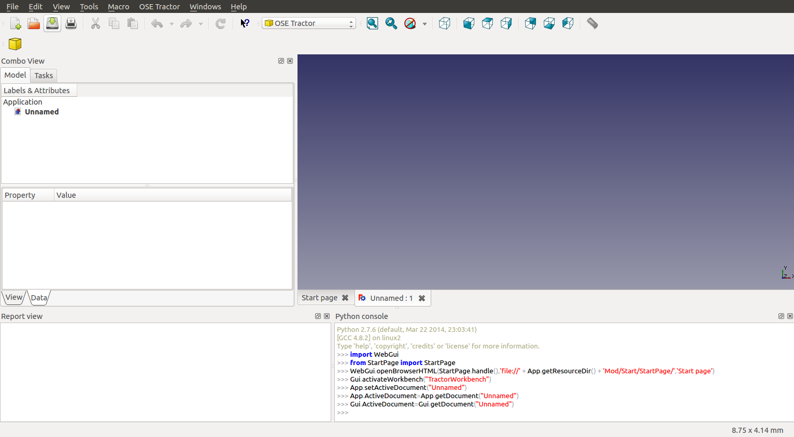

# OSE Workbench Platform
[](https://badge.fury.io/py/ose-workbench-platform)

* [Introduction](#introduction)
* [Pre-Requisites](#pre-requisites)
* [Installation](#installation)
* [Containerization](#containerization)
* [Unit Tests](#unit-tests)
* [Documentation](#documentation)
* [Commands](#commands)
  * [container](#container)
  * [test](#test)
  * [docs](#docs)
  * [init](#init)
  * [browse](#browse)
* [Generating Code](#generating-code)
* [Contributing](#contributing)
* [License](#license)

## Introduction
A platform for developing workbenches for Open Source Ecology (OSE).

OSE defines a "workbench" as a set of tools in CAD software to design and make a particular machine.

Each workbench OSE develops for one of it's machines has certain common development-time or "dev-time" needs and dependencies.

For example, running unit tests, making documentation, and generating code to streamline workbench development.

Rather than duplicate the approaches to each of these needs, `ose-workbench-platform` abstracts those needs into a common platform so they aren't the concern of individual OSE workbench maintainers.

Each workbench maintainer doesn't need to know or care about the particular versions and libraries we use to solve those needs, nor the particular configuration.

Having a common platform for OSE workbench development also makes it easier for developers to readily switch between workbenches by providing a common tool-set.

`ose-workbench-platform` provides a command-line interface (CLI), via the `osewb` command, containing commands for common dev-time tasks such as running all tests, making documentation, initializing new workbenches, and even generating code for common tasks.

## Pre-Requisites
1. Install [Git](https://git-scm.com/)
2. Install [Python](https://www.python.org/)
3. Install [Docker](https://docs.docker.com/get-docker/)

## Installation

    pip install ose-workbench-platform

After installing `ose-workbench-platform`, you'll have access to the `osewb` command.

See [Commands](#commands) for additional information.

## Containerization
We use [Docker](https://en.wikipedia.org/wiki/Docker_(software)) to create a reproducible [virtualized OSE workbench development environment](https://en.wikipedia.org/wiki/OS-level_virtualization) with requisite dependencies for development-time tasks like running unit tests, and generating documentation from source-code comments.

While having to [install and learn Docker](https://www.docker.com/) is a burden, our hope is that it's simpler than developers having to manually setup their own local development environment with the requisite dependencies for OSE workbench development.

## Unit Tests
For running unit tests we use [pytest](https://docs.pytest.org/en/latest/).

For test coverage, we use [coverage.py](https://coverage.readthedocs.io/en/latest/) and [pytest-cov](https://pytest-cov.readthedocs.io/en/latest/).

## Documentation
For building documentation, we use [Sphinx](https://www.sphinx-doc.org/en/master/).

For hosting documentation, we use a free service for **open-source** projects called [Read the Docs](https://readthedocs.org/).

For a modern and mobile-friendly look, we use [Read the Docs Sphinx Theme](https://sphinx-rtd-theme.readthedocs.io/en/stable/).

## Commands
The `osewb` command contains various sub-commands for performing common dev-time tasks of a OSE workbench.

```
$ osewb -h ↵
usage: osewb <command> [<args>]

A collection commands for OSE workbench development.

optional arguments:
  -h, --help            show this help message and exit

Commands:
  {container,test,docs,init,browse}
    container           Commands for interacting with containers
    test                Run tests in workbench
    docs                Make documentation
    init                Initialize new workbench
    browse              Commands for opening documents in a web browser
```

Each sub-command may have flags and arguments, and additional information can be discovered via `osewb <command> -h` or `--help`.

Is `osewb` too many characters to type? We recommend [aliasing](https://en.wikipedia.org/wiki/Alias_(command)) the ``osewb`` command as ``ose`` to reduce typing and increase speed even further.

### container
OSE Workbench Platform includes a `container` command to make interacting with the requisite container for running tests and building documentation easier.

```
$ osewb container -h ↵
usage: osewb container <command>

optional arguments:
  -h, --help      show this help message and exit

Commands:
  {image,create}
    image         Build image for container
    create        Create container -- must be in workbench repository
```

In order to run the `test` and `docs` commands, you must first:

1. Build the `ose-workbench-platform` image using `osewb container image`
2. Create a container for your workbench by running `osewb container create` within the workbench repository

Note, you only need **one** `ose-workbench-platform` image that acts as a blue-print for creating a container per workbench.

Workbench containers will be named after the base package in the workbench repository (e.g. `ose3dprinter`, `osetractor`, `osepowercube`, etc.).

Once the container for the workbench is created, you may interact with it using normal `docker` commands.

Some common operations you may wish to perform on the container are:

|Description|Command|
|-----------|-------|
|**Starting** the container|`docker start <container name>`|
|**Stopping** the container|`docker stop <container name>`|
|**Removing** the container|`docker rm <container name>`|

Refer to the [Docker CLI reference documentation](https://docs.docker.com/engine/reference/commandline/docker/) for additional information.

### test
OSE Workbench Platform includes a `test` command for interacting with the test-suite of a workbench.

```
$ osewb test -h ↵
usage: osewb test

optional arguments:
  -h, --help      show this help message and exit
  -c, --coverage  Run tests with coverage, and generate report
```

To run the entire unit-test suite for a workbench, run:

    osewb test

For running tests with coverage and generating a coverage report, pass the `-c` or `--coverage` flag to the `test` command:

    osewb test --coverage

### docs
OSE Workbench Platform includes a `docs` command for building the documentation of a workbench.

    osewb docs

The `docs` command will:

* Delete the `docs/_build/` directory
* Delete the `docs/<base package>/` directory
* Re-generate `docs/_build/` and `docs/<base package>/` by running `sphinx-build . _build` within `docs/` using the Sphinx configuration specified in `docs/conf.py`
* Generate property tables for each Model class in the workbench and output them as `.csv` files in `docs/property_table/`

For additional information, see [sphinx-build](https://www.sphinx-doc.org/en/master/man/sphinx-build.html) and [Sphinx Configuration](https://www.sphinx-doc.org/en/master/usage/configuration.html).

### init
OSE Workbench Platform includes a `init` command for initializing a new workbench.

Navigate to where you want to initialize a directory for your new workbench. Then run:

    osewb init

You'll be prompted to enter the machine name in **Title Case**.
```
machine_display_name [CEB Brick Press]: Tractor ↵
```

Then, you'll be prompted for several more values.

Each successive prompt derives it's default value from answers to previous prompts.

You can press the <kbd>Enter</kbd> key for most prompts to stick with the defaults.
```
repo_name [ose-tractor-workbench]: ↵
machine_title [OSE Tractor]: ↵
workbench_title [OSE Tractor Workbench]: ↵
base_package [osetractor]: ↵
command_registry_filename [OSE-Tractor]: ↵
command_namespace [OSETractor]: ↵
workbench_class_filename [tractor_workbench]: ↵
workbench_class_name [TractorWorkbench]: ↵
```

The above examples initializes a new workbench, in a `ose-tractor-workbench` directory, with the basic structure and files needed for the workbench.

```
ose-tractor-workbench
    ├── InitGui.py
    ├── osetractor
    │   ├── app
    │   │   ├── __init__.py
    │   │   └── part
    │   │       ├── box
    │   │       │   ├── box.py
    │   │       │   └── __init__.py
    │   │       └── __init__.py
    │   ├── gui
    │   │   ├── command
    │   │   │   ├── add_box
    │   │   │   │   ├── add_box_command.py
    │   │   │   │   └── __init__.py
    │   │   │   └── __init__.py
    │   │   ├── icon
    │   │   │   ├── Box.svg
    │   │   │   └── __init__.py
    │   │   ├── __init__.py
    │   │   ├── OSE-Tractor.py
    │   │   └── tractor_workbench.py
    │   └── __init__.py
    └── README.md
```



### browse
OSE Workbench Platform includes a `browse` covenience command for opening documentation and coverage reports in a web browser.

```
$ osewb browse -h ↵
usage: osewb browse <command>

optional arguments:
  -h, --help       show this help message and exit

Commands:
  {docs,coverage}
    docs           Opens docs in web browser
    coverage       Opens coverage report in web browser
```

The `docs` command opens `docs/_build/index.html` in a web browser, while `coverage` opens `htmlcov/index.html` in a web browser.

## Generating Code
Within the root of a workbench repository, run the `make` command.

For example,

    osewb make command AddMotor

Will generate a new `AddMotor` command class.

> **NOTE:** This idea is not yet implemented.

## Contributing
See [Contributing Guidelines](./CONTRIBUTING.md).

## License
Licensed under the [GNU Lesser General Public License, version 2.1](https://www.gnu.org/licenses/old-licenses/lgpl-2.1.en.html) or LGPL v2.1. See [LICENSE](./LICENSE) for details.

This is the same license as [FreeCAD](https://wiki.freecadweb.org/Licence) to ensure this code could potentially be incorporated into future FreeCAD modules or FreeCAD source itself.
